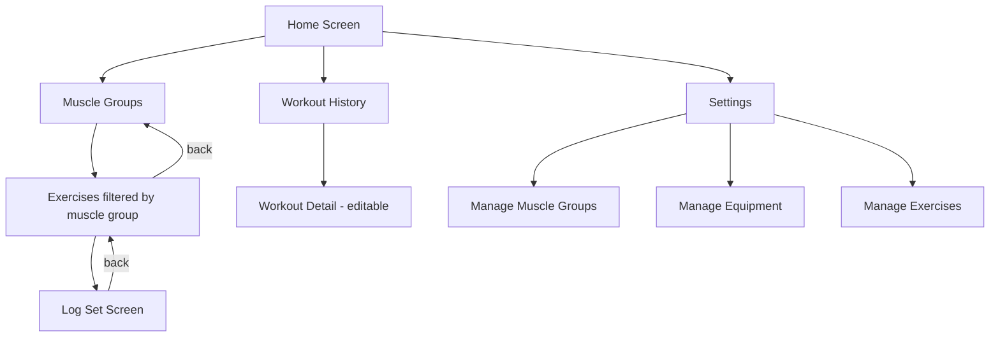

# LazyFit — Android Workout Tracker (Python + Briefcase + Toga)

## Overview

A mobile workout-logging app built with **Python 3.13**, **Briefcase** (packaging) and **Toga** (UI toolkit). Data is stored locally in **SQLite** via Python's built-in `sqlite3` module. The UI supports **Russian** and **English** with a runtime language switcher.

---

## Data Model

```
MuscleGroup
  id          INTEGER PK
  name        TEXT NOT NULL
  weekly_sets INTEGER (optional)

Equipment
  id   INTEGER PK
  name TEXT NOT NULL

Exercise
  id              INTEGER PK
  name            TEXT NOT NULL
  muscle_group_id INTEGER FK → MuscleGroup
  type            TEXT CHECK(type IN ('reps','time'))

WorkoutSet
  id            INTEGER PK
  date          TEXT NOT NULL  -- ISO date YYYY-MM-DD (groups sets into a "workout")
  exercise_id   INTEGER FK → Exercise
  order_index   INTEGER        -- ordering within the day
  reps          INTEGER (nullable, used when type='reps')
  duration_sec  INTEGER (nullable, used when type='time')
  equipment_id  INTEGER FK → Equipment (nullable)
  created_at    TEXT NOT NULL  -- ISO datetime
```

A **"workout"** is the logical grouping of all `WorkoutSet` rows sharing the same `date`. No separate Workout table is needed.

---

## Project Structure

```
lazy-fit/
├── pyproject.toml          # Briefcase config
├── main.py                 # Entry point (calls app.main())
├── src/
│   └── lazy_fit/
│       ├── __init__.py
│       ├── app.py          # Toga App + navigation controller
│       ├── db/
│       │   ├── __init__.py
│       │   ├── connection.py   # get_connection(), init_db()
│       │   └── models.py       # CRUD functions for each entity
│       ├── i18n/
│       │   ├── __init__.py     # t(key) translation function
│       │   ├── ru.py           # Russian strings dict
│       │   └── en.py           # English strings dict
│       └── screens/
│           ├── __init__.py
│           ├── home.py             # Home / main menu
│           ├── muscle_groups.py    # Muscle group list (workout entry point)
│           ├── exercises.py        # Exercise list filtered by muscle group
│           ├── log_set.py          # Log a set + timer widget + today's history panel
│           ├── history.py          # Past workouts list by date
│           ├── workout_detail.py   # Single workout detail (editable)
│           └── settings/
│               ├── __init__.py
│               ├── manage_muscle_groups.py
│               ├── manage_equipment.py
│               └── manage_exercises.py
```

---

## Navigation Flow



---

## Screen Descriptions

### Home Screen
- Buttons: **Start Workout**, **History**, **Settings**
- Language toggle button (RU / EN) in the top bar

### Muscle Groups Screen
- Scrollable list of muscle groups
- Each row shows name + optional weekly_sets target
- Tap → navigate to Exercises screen for that group

### Exercises Screen
- Filtered list of exercises for the selected muscle group
- Tap → navigate to Log Set screen

### Log Set Screen
- Top: exercise name + muscle group
- Input form:
  - If `type='reps'`: numeric field for reps
  - If `type='time'`: **Timer widget** — Start/Stop/Reset stopwatch displaying MM:SS; elapsed time auto-fills the duration field. Manual override still possible.
  - Optional equipment picker (dropdown/select)
  - **Save Set** button
- Bottom panel: **Today's Workout Summary**
  - Sets grouped by exercise (exercise name as section header)
  - Each set shown as a row (reps/time + equipment if set)
  - Swipe-to-delete or delete button per set

### Workout History Screen
- List of past workout dates (descending)
- Each row: date + number of sets + muscle groups worked
- Tap → Workout Detail screen

### Workout Detail Screen
- Date header
- Sets grouped by exercise
- Edit/delete individual sets
- Delete entire workout (all sets for that date)

### Settings Screens (CRUD for reference data)
- **Manage Muscle Groups**: list + add/edit/delete
- **Manage Equipment**: list + add/edit/delete
- **Manage Exercises**: list + add/edit/delete (with muscle group and type selection)

---

## i18n Strategy

A simple dictionary-based approach:

```python
# i18n/__init__.py
_lang = 'ru'
_strings = {}

def set_language(lang: str):
    global _lang, _strings
    _lang = lang
    from lazy_fit.i18n import ru, en
    _strings = ru.strings if lang == 'ru' else en.strings

def t(key: str) -> str:
    return _strings.get(key, key)
```

All UI labels use `t('key')`. Switching language rebuilds the current screen.

---

## Briefcase Configuration (pyproject.toml additions)

```toml
[tool.briefcase]
project_name = "LazyFit"
bundle = "com.lazyfit"
version = "0.1.0"
url = "https://github.com/user/lazy-fit"
license = "MIT"
author = "Author"
author_email = "author@example.com"

[tool.briefcase.app.lazy-fit]
formal_name = "LazyFit"
description = "Workout tracker"
long_description = "Track your gym workouts"
sources = ["src/lazy_fit"]
requires = ["toga>=0.5.3"]

[tool.briefcase.app.lazy-fit.android]
requires = []
```

---

## Key Technical Decisions

| Decision | Choice | Reason |
|---|---|---|
| UI framework | Toga | Native Android widgets via Briefcase |
| Database | SQLite via sqlite3 | Built-in, no extra deps, works on Android |
| Navigation | Manual stack in app.py | Toga lacks built-in router; simple push/pop |
| Localization | Dict-based t() | No external deps needed |
| Workout grouping | By date string | Simple, no extra table |

---

## Implementation Order

1. **pyproject.toml** — add Briefcase app config
2. **db/connection.py + db/models.py** — schema + CRUD
3. **i18n/** — RU + EN string dicts + `t()` helper
4. **app.py** — Toga App, navigation controller (push/pop screens)
5. **screens/home.py** — Home screen
6. **screens/muscle_groups.py** — Muscle group list
7. **screens/exercises.py** — Exercise list
8. **screens/log_set.py** — Set logging + today's summary
9. **screens/history.py + workout_detail.py** — History
10. **screens/settings/** — CRUD screens for reference data
